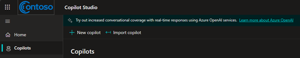
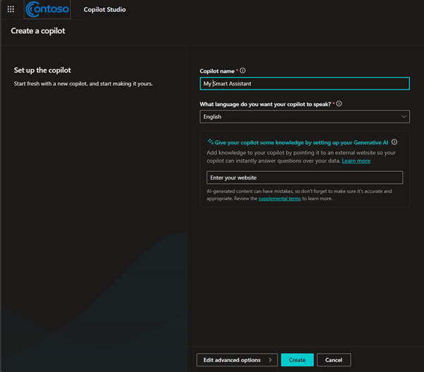

# Using CoPilot Studio, build a Chat with your Data Chatbot.

## Module 1 

Create a copilot

1.	Go to the Microsoft [Copilot Studio](https://copilotstudio.microsoft.com/) home page.

2.	Select + New copilot from the Copilots page, or select Home then choose + Create a copilot.

 

3.	For Copilot name, enter a name for your copilot and hit Create
 

