# Making the Smart Assistant available to your apps via an API


## Module 3

In this module we will be crating an API that can be used by your Apps (eg. A custom Copilot app) to interact with your Azure OpenAI Smart Assistant.

We will be doing the following activities: 

1. Create an Azure `Function App` 
2. Create an Azure `API Management` API
3. Connect the `Function App` as a backend to the API
4. Connect the API to a PowerApp (which is connected to Teams)

---

### Activity 1: Create an Azure Function App

In this activity, we will be creating a function that can respond to HTTP events, using some existing Python code. 

This function will act as the glue between your PowerApp and your Smart Assistant.


#### Option 1: Using the Azure Portal

1. Sign in to the Azure portal @ [https://ms.portal.azure.com/#home](https://ms.portal.azure.com/#home)

1. In the left-hand menu (or from the shortcuts menu at the top), click on "Create a resource".

> 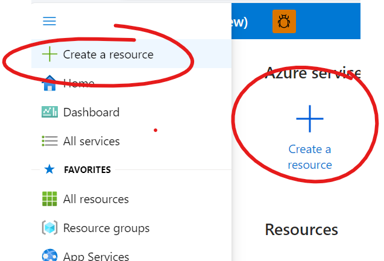

3. Next, search for "Function App" in the search input and then  select it.

> 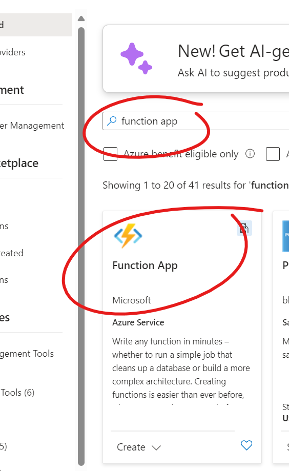

4. In the "Function App" window, click the "Create" button.

> 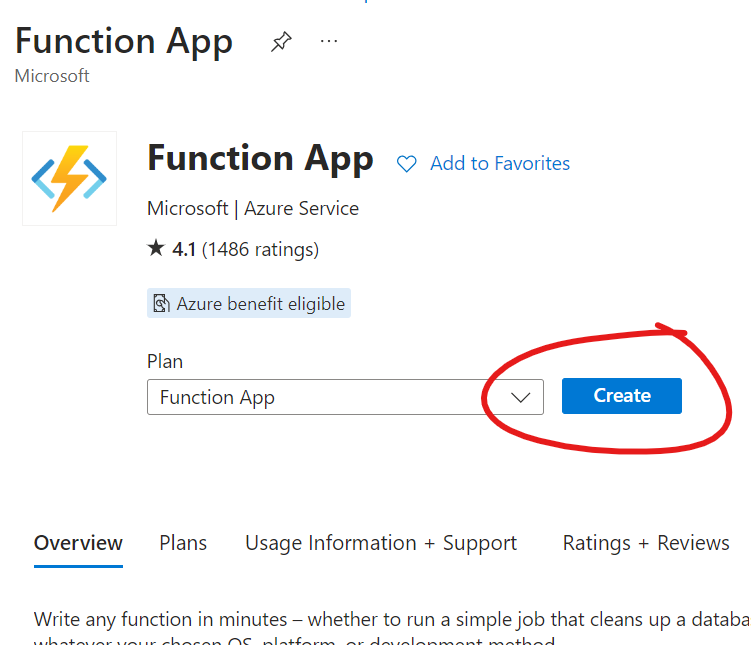

5. In the page that loads, fill out all the necessary details:

  * **Subscription**: Choose your Azure subscription.
  * **Resource Group**: Select a resource group to use (or create a new one)
  * **Function App name**: Give your app a name (it will need to be a globally unique name)
  * **Deployment Model**: Choose `Code`
  * **Runtime stack**: Select `Python`
  * **Version**: Choose the `3.11` version 
  * **Region**: Select a region for your function (Eg. "Australia East")
  * **Operating SYstem**: Choose `Linux`
  * **Hosting Plan**: Select `Consumption`

  Then, click on the `Next: Storage` button to go to the storage account selection.
  
  6. Select a storage account from the list (or create a new one), then Click `Review + Create` (skipping the remaining configuration panels)

  7. Review the configuration, then click `Create` to go ahead and create the app.

  8. Now, wait for the app to be created

> 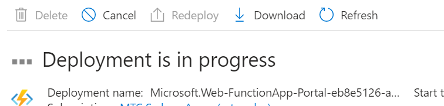

When complete, click on the blue `Go to resource` button to open the app. 

  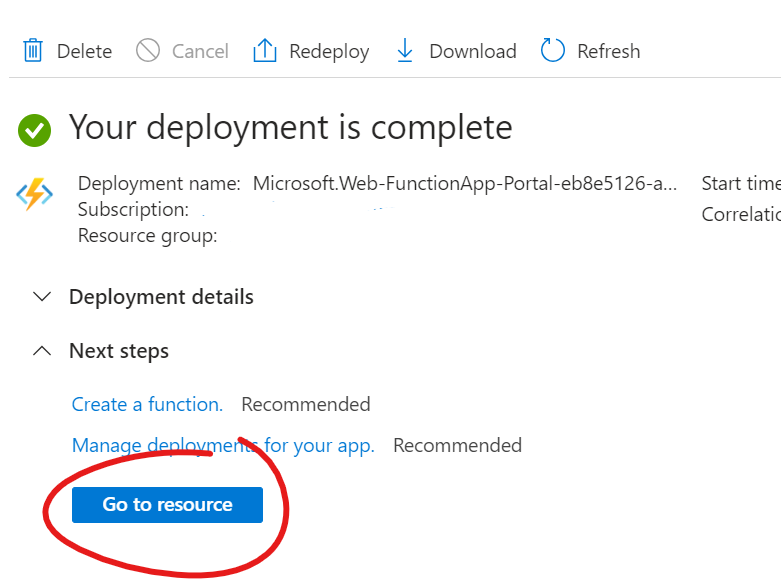

  
### Activity 2: Clone the Function repo + Publish it to your Function App

In this activity, you will clone the example function code and publish it to your new application.


0. Setup pre-requisites

  0.1 Install Azure Functions Core Tools, following instructions found [here](https://github.com/Azure/azure-functions-core-tools)

  0.2 Install the Azure CLI, following the instructions found [here](https://learn.microsoft.com/en-us/cli/azure/install-azure-cli)


  Alternatively, if you have VSCode installed, you can choose to install the [Azure Tools](https://marketplace.visualstudio.com/items?itemName=ms-vscode.vscode-node-azure-pack) extension and use the VSCode extension to complete the next steps.


1. Clone the [Smart Assistant Chat Function](https://github.com/MTC-Sydney/smart-assistant-azure-function) Repo

```bash
git clone git@github.com:MTC-Sydney/smart-assistant-azure-function.git
```

2. Browse to the cloned repo

```bash
cd smart-assistant-azure-function
```

3. Setup a `local-settings.json` file by copying the default settings file

```bash
cp local.settings.json.default local.settings.json
```

4. Publish the code to your Function app

```bash
func azure functionapp publish <your-app-name>
```

NB: You may be asked to login to your Azure account to complete this step.

5. Return to your Function App in the portal and refresh the page - you should now see five functions in your app: 

* ask_question
* list_assistants
* list_files
* upload_file
* upsert_assistant

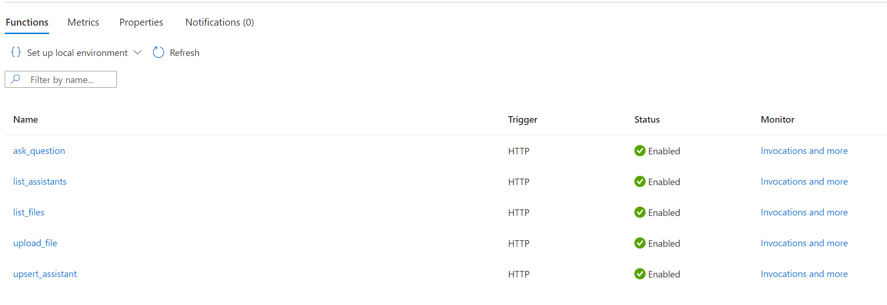

6. Add your `Azure OpenAI API Key` to the App Settings (to enable the function to access the Azure OpenAI API)

6.1 Browse to the [Azure OpenAI Portal](https://oai.azure.com/portal/)

6.2 Click on `Chat`, then click on the `View Code` button

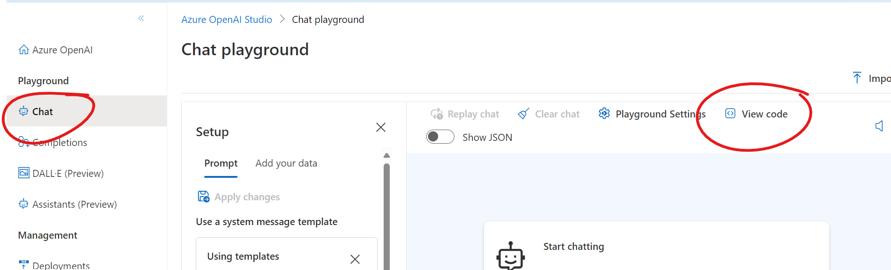

6.3 Click on the copy button next to the input with the *hidden* API key  

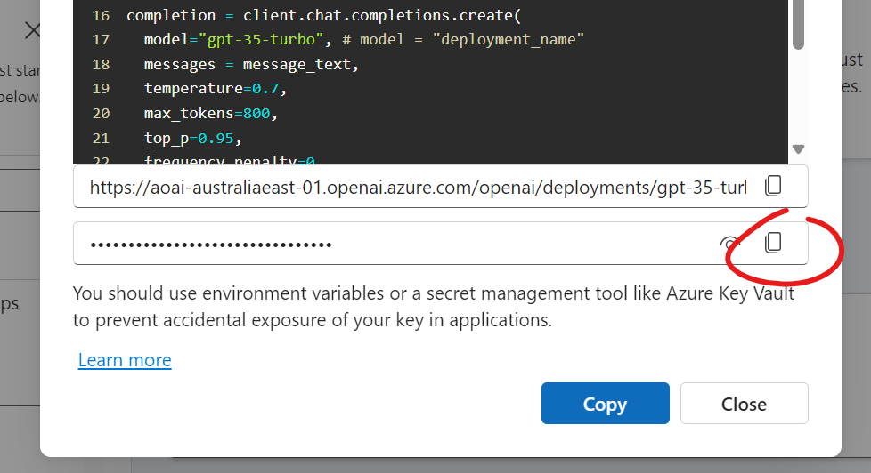

6.4 Return to the Function App portal, click on `Environment Variables`, then add a new variable called `openai_key` (pasting the copied key as the value).

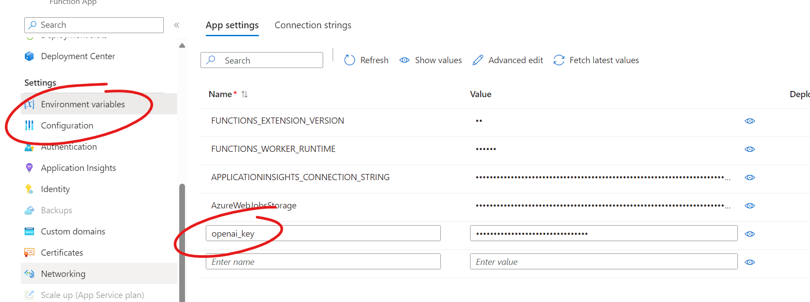

6.5 Click `Save` to save the new variable.


### Activity 3: Create an Azure API Management API

In this activity we will be creating an API to present a managed endpoint for our Function App.

1. Return to the Azure portal @ [https://ms.portal.azure.com/#home](https://ms.portal.azure.com/#home)

2. In the left-hand menu (or from the shortcuts menu at the top), click on "Create a resource".


3. Search for `API Management`, and then select it from the results

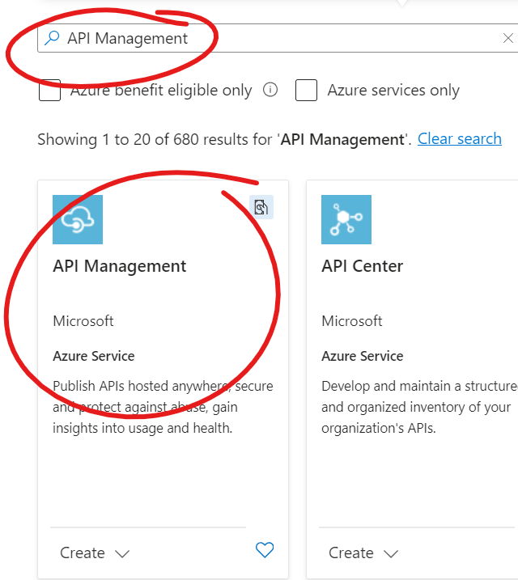

4. On the page that loads, click `Create`

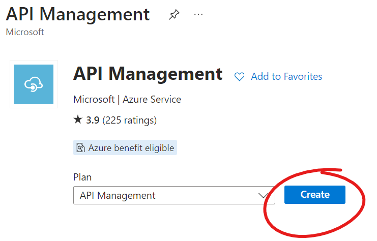

5.  In the page that loads, fill out all the necessary details:

  * **Subscription**: Choose your Azure subscription.
  * **Resource Group**: Select a resource group to use (or create a new one)
  * **Region**: Select a region for your API (Eg. "Australia East") - NB: It is recommended to select the same region as your Function to minimise latency
  * **Resource Name**: Give your API a name
  * **Organization Name**: Put your Organisation's name in here (it'll be used in the Developer Portal, if you deploy it)
  * **Administrator Email**: Put in an email address for the administrator of this API
  * **Pricing Tier**: Just choose `Developer` for now (you can change it later) 
  
  Then, click on the `Review + Create` button to skip to use the defaults for all remaining configuration options.
  
6. Review the configuration settings, and when ready, click on `Create`

You will now need to wait for the API resources to be created (this will take a few minutes).

7. Click on `Go to Resource` to open the Management portal for your API

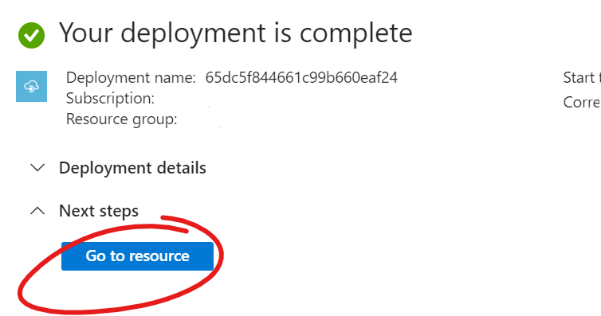

8. Now we need to import our Function App, start by click on `APIs` in the left-hand side panel, and then selecting `Function App` from the available options

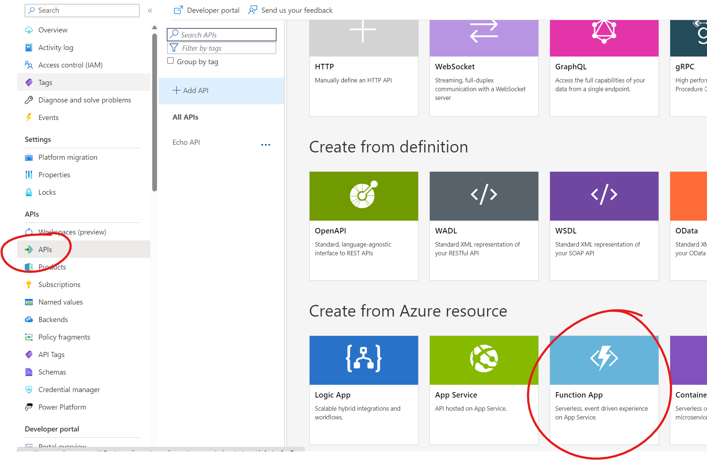

9. Fill out the details in the popup dialog: 

* **Function App** - Click Browse, and select the Function App you just created (after selecting the fucntion, ensure all five HTTP triggers are ticked before clicking on `Select`)
* **Display Name** - Give your API a descriptive name
* **Name** - Specify a name for your API
* **API URL Suffix** - Specify an initial path for the API (can also leave blank)

10. Click Create to create the API

11. Once your Function App's HTTP triggers have been imported, you should now see them listed in your API design

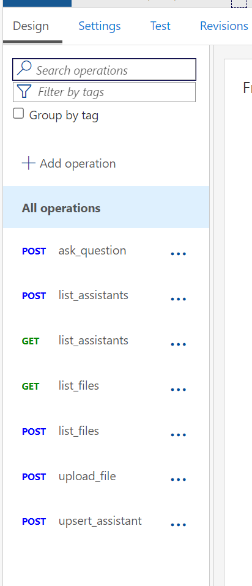

12. Click on the `Settings` tab

13. In the `Products` input, choose the "Starter" product

14. In the Subscription header name, change it to `subscription-key` (or whatever header you want to use for specifying the subscription key)

15. Click `Save`

16. Click back to the `Overview` of your API (in the Left Hand Panel), and copy the `Gateway URL` (paste it somewhere where you can refer back to it)

17. Click on `Subscriptions` in the Left Hand Panel, and copy the primary key of the "Product: Starter" subscription

18. Now, test your API by listing the assistants

```bash
curl -XGET -v -H "subscription-key: <subscription-key> <gateway-url>/list-assistants 
```

You should get back a `200` response, and if you have any assistants, then also a list of those assistants.


### Activity 4: Celebrate

Woohoo - you now have a Smart Assistants API ready to use within your custom applications :)


