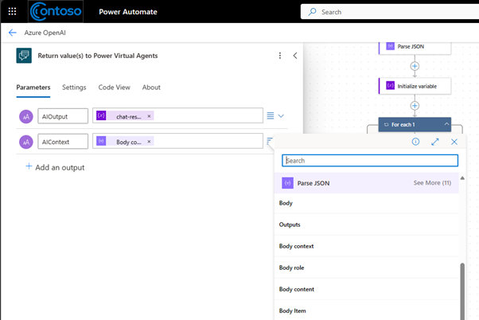
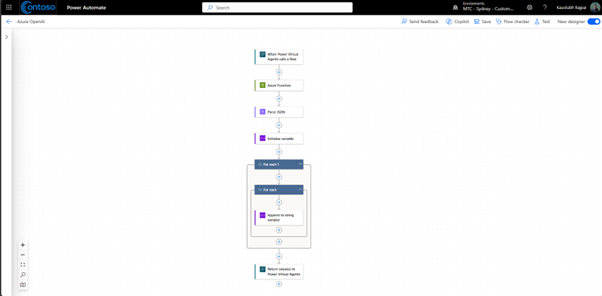

# Creating an Azure Open AI Assistant for Data Analysis


## Module 4 - Publish to Teams

### Connect Smart Assistant to Azure OpenAI Assistants via an Azure Function

#### Edit copilot topic

1.	Go to the Microsoft Copilot Studio home page.
   
   
  	
2.	Click the copilot you wish to edit.
  	
3.	Under the “Topics & Plugin” section click the “System” tab.
   
   
  	 
4.	Select the “Fallback” topic name to edit.
5.	Under the Trigger box, hit the “+” button and select “Call an action” then “Create a flow”.
    
   
  	
#### Create connection to Azure OpenAI Assistants

6.	This will open a new tab for you to create a flow with a start and an end step to connect with your copilot.
    
   
  	
7.	Click on the trigger step “When Power Virtual Agent calls a flow” and add two input parameters
-	UserInput
-	Context
    
   
  	
8.	Click on the “+” button in the between the two steps and search for “HTTP” action
    
   
  	
9.	Select the “HTTP” action and complete the following details
-	Rename step to “Azure Function”
-	URI - https://\<your-api-url-from-module3>/ai/ask-question
-	Method – POST
-	Headers:
    -	`subscription-key`: \<subscription-key-to-your-api-from-module3>
-	Body: 

```JSON
{
   "assistants": [
     "<name-of-your-assistant>"
   ],
   "context": "",
   "prompt": 
}
```
  	
10.	Click between the quotation marks (\"\") for the `context` value variable and then click the lightning icon.

11.	Then select the dynamic variable “Context” under “When Power Virtual Agents calls a flow” 
    
   
  
  	
12.	Now, click where the value goes for the `prompt` field, and then click on the **fx** icon. In the large "function" input, set the function to: 

```
string(triggerBody()?['text'])
```


13. The Azure Function HTTP Action config should look something like this: 


  > NB: This image shows how you can work with multiple assistants with an interpreter - this is an advanced integration and not required for this module. 

14.	Add a new action “Parse JSON”
15.	Under the content parameter, select the lightning icon and select “Body” from the “Azure Function” section.
    
   
  	
16.	Paste the following sample schema in the schema box
```JSON
{
    "type": "object",
    "properties": {
        "context": {
            "type": "string"
        },
        "data": {
            "type": "object",
            "properties": {
                "responses": {
                    "type": "array",
                    "items": {
                        "type": "object",
                        "properties": {
                            "role": {
                                "type": "string"
                            },
                            "content": {
                                "type": "array",
                                "items": {
                                    "type": "string"
                                }
                            },
                            "assistant": {
                                "type": "string"
                            }
                        },
                        "required": [
                            "role",
                            "content",
                            "assistant"
                        ]
                    }
                },
                "message_id": {
                    "type": "string"
                }
            }
        }
    }
}
```
17.	Add another action; “Initialize variable” to capture the Assistant response.
18.	Name the variable “chat-response” and type as “String”.
    
   
  	
19.	After initializing the variable, click the “+” button and add and action called “Apply to each”.
    
   
  	
20.	Under the “Parameters” tab, click the lightning icon for “Select An Output From Previous Steps” and add “Body responses” from the Parse JSON section.
    
   
  	
21.	Inside the 1st “Apply to each” loop hit the “+” button and add another “Apply to each” loop.
    
   
  	
22.	Under the “Parameters” tab, click the lightning icon for “Select An Output From Previous Steps” and add “Body content” from the Parse JSON section.
    
   
  	
23.	In the 2nd “Apply to each” loop, hit the “+” button and search for “Append to string variable” action.
     
   
  	
24.	Under the “Parameters” tab Select “chat-response” and under value, click the lightning icon.
25.	Then select “Current item” under the “Apply to each” section. IMPORTANT: make sure the current item value is from the nested “Apply to each” section and not the outer “Apply to each” section.
    
   
  	
26.	Click on the last step “Return value(s) to Power Virtual Agents” and add two parameters
-	AIOutput – Click on the lightning icon and select “chat response” under the “Variables” section.
    
   
  	
-	AIContext – Click on the lightning icon and select “Body context” under the “Parse JSON” section.
    
   
  	
27.	Click save 
    
   
  	

#### Complete topic authoring
28.	Add the following parameters to the Action in topic.
     
   
  	

29.	Complete the topic branching as follows.
    
   

   
    
   
  	


### Publish the copilot to Teams.

1.	In the left navigation pane of copilot studio, click publish.
2.	Then click the “Publish” button.
     
   
  	

3.	Expand the “Settings” section in the navigation pane and then click “Channels”.
     
   
  	

4.	Click on the Teams tile and then click “Open Bot”
    
   
  	


