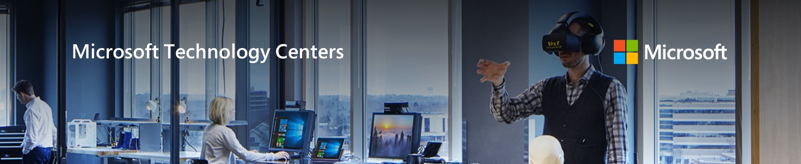
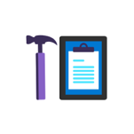

# assistantsprototypeworkshop
 assistants and copilot studio rapid prototyping workshop

A Rapid Prototyping Workshop where we use CoPilot Studio and Azure Open AI to develop your first chat with your data scenario as well analyzing any structured data using the power of Assistants.  

## Introduction

This prototype workshop is divided into three parts.

1.  Using CoPilot Studio, build a Chat with your Data Chatbot. 

2.  Creating an Azure Open AI Assistant for Data Analysis

3.  Connecting these together with API Calls and as a result making a smart Assistant that is available through Teams. 

| Module | Topic | Duration |
|--------|--------------------------------|----|
|[Module 1](./Module1.md) |  Creating a Chat with Your Data Chatbot using CoPilot Studio| 1 hour |
| [Module 2](./Module2.md) | Creating an Azure Open AI Assistant for Data Analysis | 1 hour |
| [Module 3](./Module3.md) | Making the Assistant available through Teams | 1 hour1 |

